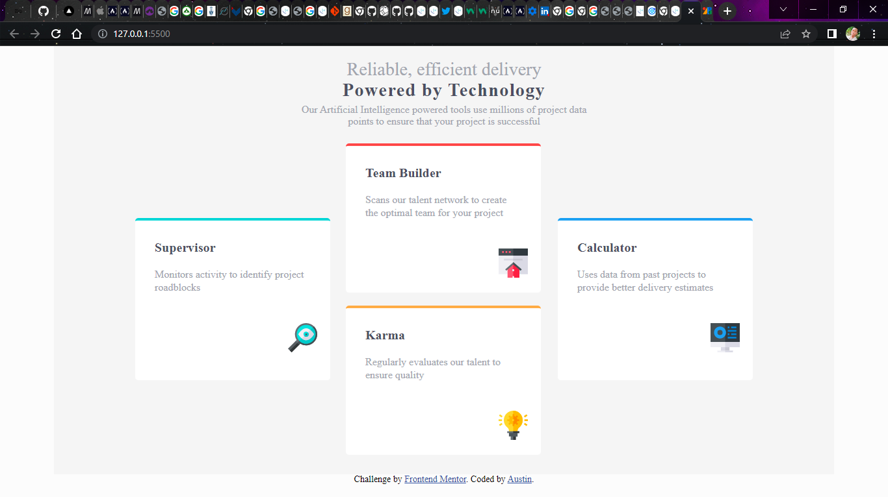

# Frontend Mentor - Four card feature section solution

This is a solution to the [Four card feature section challenge on Frontend Mentor](https://www.frontendmentor.io/challenges/four-card-feature-section-weK1eFYK). Frontend Mentor challenges help you improve your coding skills by building realistic projects.

## Overview

This is a challenge on the design of a four card feature section.
Every Line of code writte by Austin.

### Screenshot

### Links

- Solution URL: [Add solution URL here](https://your-solution-url.com)
- Live Site URL: [Add live site URL here](https://your-live-site-url.com)

## My process

### Built with

- Semantic HTML5 markup
- CSS custom properties
- Flexbox
- CSS Grid

### What I learned

I have learned the concept of Css Flexbox and absolute positioining and CSS Grid
ensuring that every content of the page is contained by a landmark.

### Continued development

Taking up this chalenge at first was quite scary because of my little knowledge of CSS grid presently.
But while on this, i appreciated coding more for being able to come up with this.
I havn't made the mobile view as I'm yet to learn better about media querries.

### Useful resources

- [Google fonts](https://www.fonts.google.com) - This helped me get the required fonts used in this project.

## Author

-Name- Austin
- Frontend Mentor - [@yourusername](https://www.frontendmentor.io/profile/Ausranking)
- Twitter - [Austranking](https://www.twitter.com/austinnze1000)

## Acknowledgments

Thanks to frontend mentors who provided this challenge.
